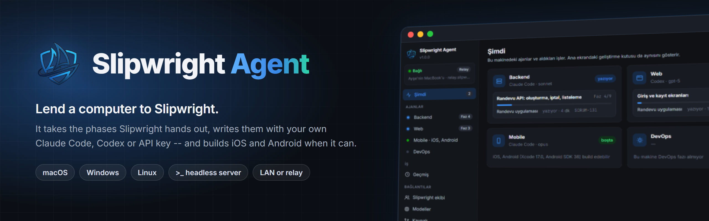
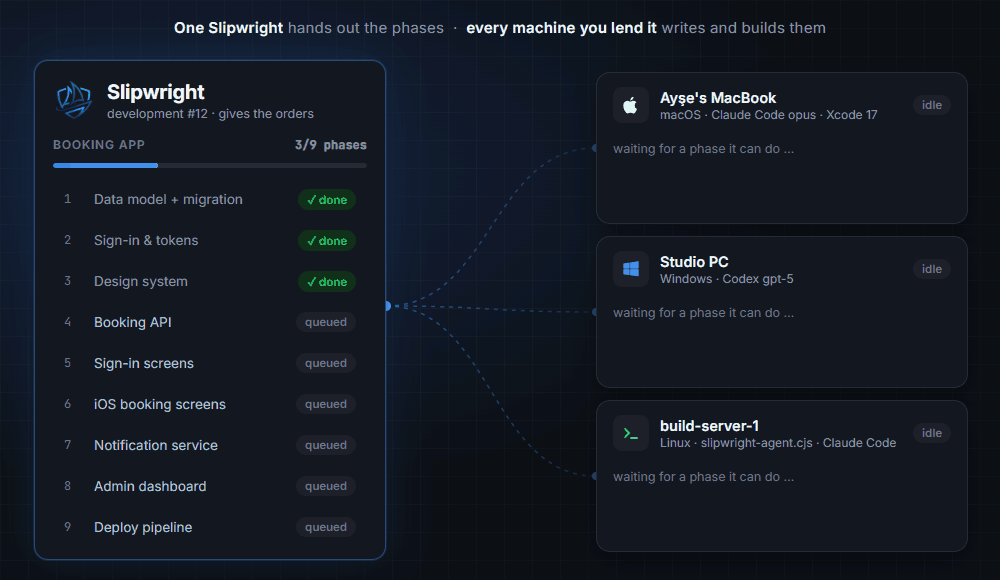
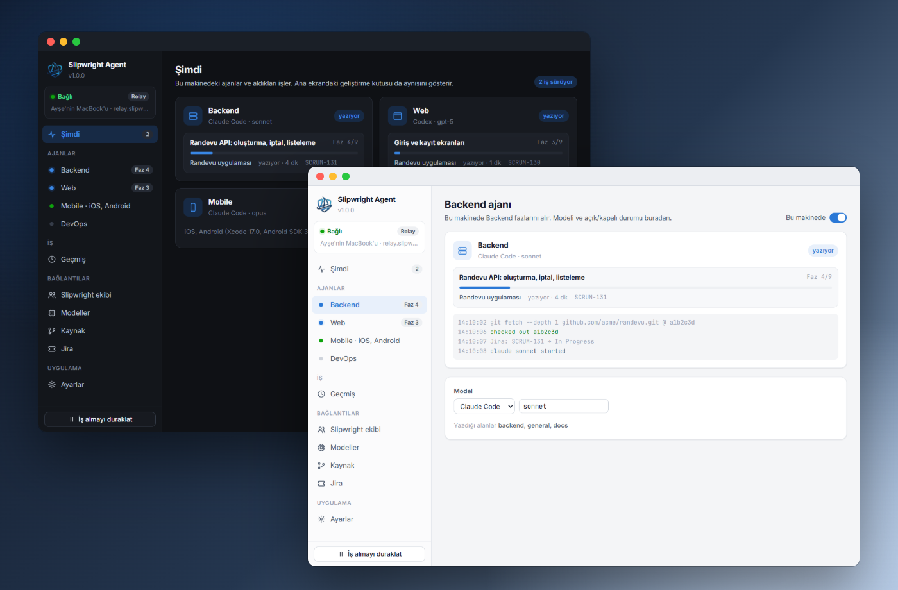
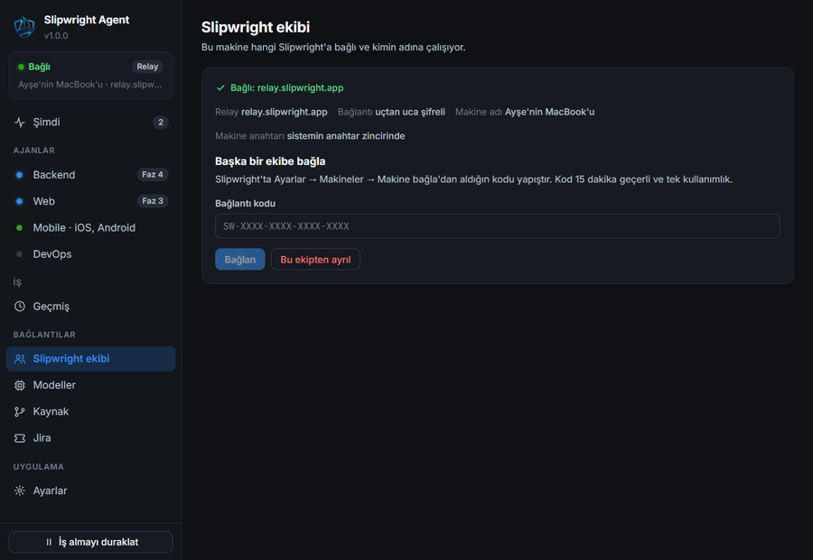
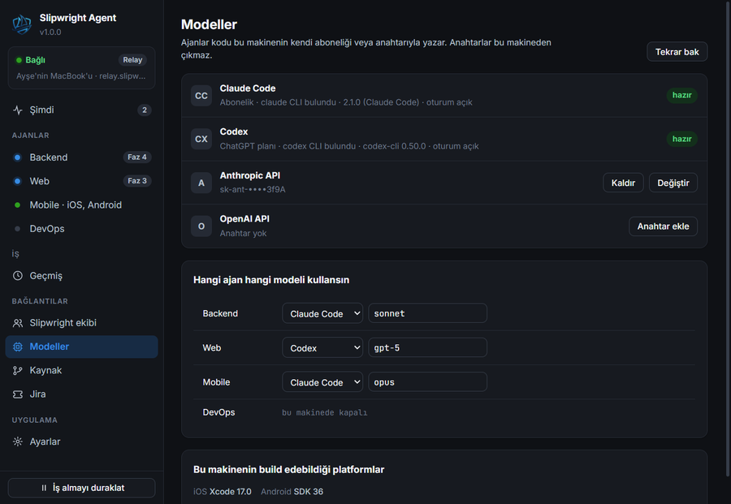
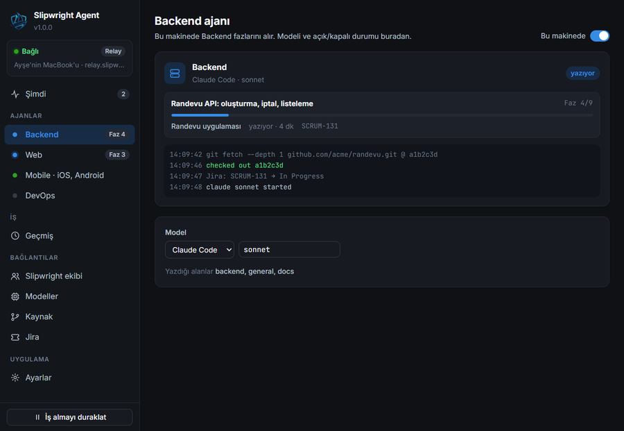
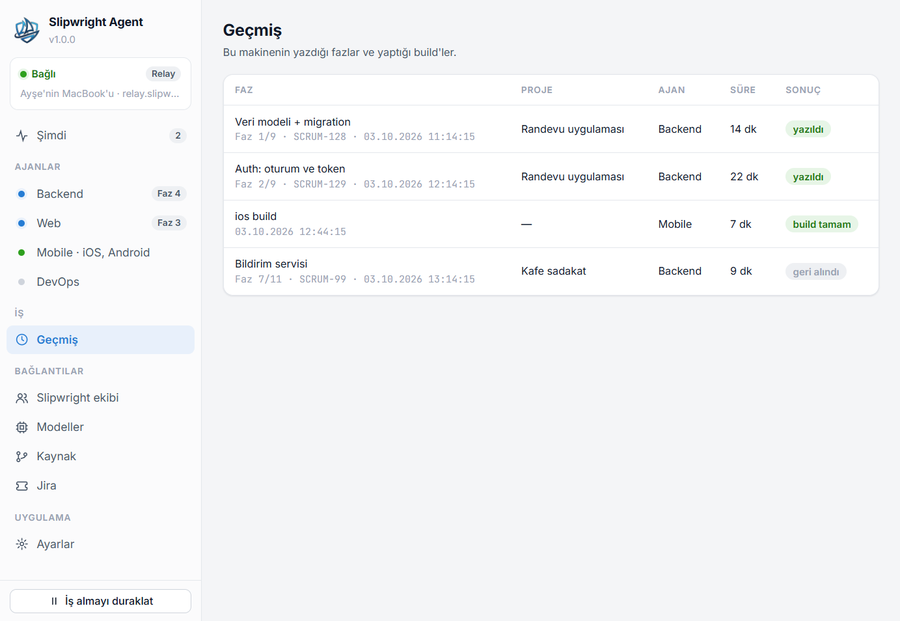

<p align="center">
  
</p>

<p align="center">
  <a href="https://github.com/ksksertac/slipwright-agent/releases/latest"></a>
  <a href="https://github.com/ksksertac/slipwright-agent/actions/workflows/ci.yml"></a>
  
  <a href="LICENSE"></a>
</p>

<p align="center">
  <a href="https://github.com/ksksertac/slipwright-agent/releases/latest/download/Slipwright-Agent-mac-arm64.dmg"><b>macOS · Apple Silicon</b></a> &nbsp;·&nbsp;
  <a href="https://github.com/ksksertac/slipwright-agent/releases/latest/download/Slipwright-Agent-mac-x64.dmg"><b>macOS · Intel</b></a> &nbsp;·&nbsp;
  <a href="https://github.com/ksksertac/slipwright-agent/releases/latest/download/Slipwright-Agent-Setup.exe"><b>Windows</b></a> &nbsp;·&nbsp;
  <a href="https://github.com/ksksertac/slipwright-agent/releases/latest/download/Slipwright-Agent.AppImage"><b>Linux AppImage</b></a> &nbsp;·&nbsp;
  <a href="https://github.com/ksksertac/slipwright-agent/releases/latest/download/slipwright-agent.deb"><b>.deb</b></a> &nbsp;·&nbsp;
  <a href="#on-a-server-slipwright-agent"><b>Headless server</b></a>
</p>

# Slipwright Agent

A desktop app (macOS, Windows, Linux) that lends this computer to a Slipwright account.
Paired once with a connection code, it takes phases to **write** with the person's own
model -- Claude Code or Codex as installed and signed in, or an Anthropic / OpenAI API key --
and **builds** iOS and Android when the machine can (Xcode, Android SDK + JDK).

## One Slipwright gives the orders, every machine does the work

<p align="center">
  
</p>

Slipwright plans a development and splits it into phases. It never runs a model or a build
on these machines itself: each agent **asks** for work it can do, and takes one phase at a
time.

- **Slipwright** keeps the plan, the gates and the order of the phases. It decides what is
  next and checks every answer -- a wrong one is a retry, never a wrong file.
- **Every machine you lend it** says what it can do -- `write:backend`, `write:web`, `ios`,
  `android` … -- and is given only that. A Mac with Xcode gets the iOS builds; a Windows PC
  with Codex writes the web phases; a Linux box over SSH runs `slipwright-agent.cjs` with
  no window at all.
- **Your own model, your own keys.** The phase is written on the machine with its own
  Claude Code or Codex sign-in, or its own API key. Keys never leave it.
- **From anywhere.** Plain HTTP on the same network, or sealed end to end through the relay
  when the machine is somewhere else.

Several machines can be lent to one account at once, so phases that do not depend on each
other are written side by side.

<p align="center">
  
</p>

<table>
  <tr>
    <td width="50%"><br><sub><b>Pair once.</b> A code from Settings → Machines, used once.</sub></td>
    <td width="50%"><br><sub><b>Your models.</b> Claude Code, Codex or an API key, per agent.</sub></td>
  </tr>
  <tr>
    <td width="50%"><br><sub><b>Watch it work.</b> Each agent's phase, progress and live log.</sub></td>
    <td width="50%"><br><sub><b>History.</b> What this machine wrote and built, and how long it took.</sub></td>
  </tr>
</table>

## Getting started

1. **Download** [the latest release](https://github.com/ksksertac/slipwright-agent/releases/latest)
   -- `Slipwright-Agent-Setup.exe` (Windows), `Slipwright-Agent-mac-arm64.dmg` /
   `Slipwright-Agent-mac-x64.dmg` (Mac), `Slipwright-Agent.AppImage` or `slipwright-agent.deb`
   (Linux), or `slipwright-agent.cjs` for a server with no window (*On a server*, below).
2. **Get a connection code** from Slipwright: **Settings → Machines → Connect a machine**.
3. **Paste it** into the app, choose which agents this machine runs and with which model.
   From then on it takes work by itself; pause it from the bottom of the window.

## How it talks to Slipwright

It speaks the worker protocol itself, in TypeScript -- plain HTTP to a server on the same
network, or sealed end to end through the relay from anywhere. Nothing of Slipwright's
Python is needed on the machine. The protocol is written down once, in the server's
repository: [docs/machines-protocol.md](https://github.com/ksksertac/slipwright/blob/main/docs/machines-protocol.md).

## Its own releases, and the server's

This app is released apart from [Slipwright](https://github.com/ksksertac/slipwright):
every merge to `main` here is the next patch (`v1.0.3` → `v1.0.4`), built for every
platform by CI and published as a GitHub release. A running app says when one is out --
under its version in the corner, and in a dialog with the release's notes -- and on Windows
and the AppImage downloads it and restarts into it at a press each (a Mac or a .deb is sent
to the release page, since an unsigned app cannot replace itself there). `slipwright-agent`
on a server says when a newer one is out.

What the two must agree on is the worker protocol. The app sends its number with every
request (`x-slipwright-protocol`, `src/main/protocol.ts`); a server that no longer speaks it
answers 426 and the app says to update instead of failing in some way nobody can read.
Changing the protocol means a change here and one in the server, and the test vectors in
`test/crypto.test.ts` are the server's own (`tests/test_phase17_relay.py`) -- both sides
must keep passing them.

## How it is put together

| | |
|---|---|
| `src/main/` | the main process: pairing, the worker loop, the models, git, Jira, secrets |
| `src/main/code.ts` | `SW-` codes, read byte for byte as `slipwright/workers.py` writes them, plus kind 5 (relay) |
| `src/main/crypto.ts`, `parts.ts`, `transport.ts` | the relay: X25519 + HKDF + ChaCha20-Poly1305 in Node's own `crypto`, 512 KiB message parts, one `request()` for LAN and relay alike |
| `src/main/worker.ts` | poll, build, write; `progress` every 15 s, a 409 drops the call |
| `src/main/models/` | Claude Code (`claude -p`, read-only tools), Codex (`codex exec`, read-only sandbox), the two APIs |
| `src/preload/` | the one typed bridge; the page is sandboxed, with no Node in it |
| `src/renderer/` | the window. Every word is in `src/renderer/src/i18n.ts`, keyed by its English text |

Secrets (the worker token, the relay keys, API keys, source and Jira tokens) are sealed with
Electron's `safeStorage` -- the Keychain on macOS, DPAPI on Windows, the keyring on Linux --
into `secrets.bin` under the app's user-data folder. Without a keyring they are kept for the
run only, never written in the clear. Settings and the last 200 handled tasks sit beside it
as JSON.

## Running it

```bash
npm install
npm run dev          # the app with hot reload
npm test             # vitest: codes, crypto vectors, parts, relay, worker loop, parsing
npm run typecheck
npm run lint
npm run build        # into out/
```

If `npm run dev` starts Node instead of a window, `ELECTRON_RUN_AS_NODE` is set in your shell
(some editors set it); unset it.

`npx electron . --screenshot shot.png [--theme light|dark] [--page models] [--demo]` renders
the window once, saves it and quits -- how the UI is checked without a person clicking.
`--demo` fills it with a made-up pairing and two running phases; it never talks to a server.
`--update available|downloading|ready|error` opens the newer-version dialog in that phase.

`test/live.test.ts` pairs with a real server when `SLIPWRIGHT_LIVE_CODE` is set; the comment
in it says how to get one from a local `slipwright serve`.

## Packaging

```bash
npm run dist:win     # NSIS installer in dist/
npm run dist:mac     # .dmg and .zip (on a Mac)
npm run dist:linux   # AppImage and .deb
npx electron-builder --win --dir   # unpacked, to try without installing
```

Icons come from `build/icon.png` (512 px, made from the web app's logo by `npm run icon`);
electron-builder derives the `.ico` and `.icns` from it. Each platform is best built on
itself: the macOS build in particular needs a Mac.

### Signing

- **macOS.** Gatekeeper refuses an app that is not signed and notarized. Both need an Apple
  Developer account (paid): set `CSC_LINK` / `CSC_KEY_PASSWORD` to the Developer ID
  certificate and `APPLE_ID`, `APPLE_APP_SPECIFIC_PASSWORD`, `APPLE_TEAM_ID`, then turn
  `notarize` on in `electron-builder.yml`. Unsigned, a person must right-click → Open the
  first time.
- **Windows.** An unsigned installer runs, but SmartScreen warns ("Windows protected your
  PC" → More info → Run anyway) until the file has reputation. A code-signing certificate
  (`CSC_LINK`, `CSC_KEY_PASSWORD`) removes the warning; an EV certificate removes it at once.
- **Linux.** Nothing to sign; the AppImage needs `chmod +x`.

## Downloads

Every release carries the app, built by CI on each platform (`.github/workflows/ci.yml`),
under names that never change, so
`https://github.com/ksksertac/slipwright-agent/releases/latest/download/<name>` is always
the newest:

| | |
|---|---|
| Windows | `Slipwright-Agent-Setup.exe` |
| macOS, Apple Silicon / Intel | `Slipwright-Agent-mac-arm64.dmg` / `Slipwright-Agent-mac-x64.dmg` (and `.zip`) |
| Linux | `Slipwright-Agent.AppImage`, `slipwright-agent.deb` |
| A server with no window | `slipwright-agent.cjs` |

## On a server: slipwright-agent

A server reached over SSH has no window and usually no keyring, so the app's worker also
comes as one file with no window at all: `out/cli/slipwright-agent.cjs`, built by
`npm run build:cli`. It needs Node 20 or newer and nothing else -- no `npm install`, no
Electron, no Python. It does what the app does, and reads what the app keeps behind its
window from **`settings.json` in the folder it is run from**.

```bash
mkdir ~/slipwright && cd ~/slipwright        # upload slipwright-agent.cjs here (SFTP)
node slipwright-agent.cjs init               # writes settings.json to fill in
# put the code from Slipwright (Settings → Machines → Connect a machine) in "code",
# choose each agent's model; upload the file again whenever you like
node slipwright-agent.cjs check              # models found, agents, tokens, pairing
node slipwright-agent.cjs                    # pairs the first time, then takes work
```

`settings.json`:

```json
{
  "code": "SW-…",
  "name": "build-server-1",
  "max_concurrent": 1,
  "work_dir": "./work",
  "run_builds": true,
  "agents": {
    "backend": { "enabled": true, "model": "claude-code:sonnet" },
    "web":     { "enabled": true, "model": "codex" },
    "mobile":  { "enabled": false },
    "devops":  { "enabled": false }
  },
  "keys":   { "anthropic": "env:ANTHROPIC_API_KEY", "openai": "" },
  "source": { "github_token": "env:GITHUB_TOKEN", "bitbucket_user": "", "bitbucket_app_password": "" },
  "jira":   { "site": "acme.atlassian.net", "email": "you@acme.com", "token": "env:JIRA_TOKEN" }
}
```

- A model is `claude-code`, `codex`, `anthropic` or `openai`, optionally `:<model>`. Claude
  Code and Codex must be installed and signed in on the server (`claude`, `codex login`).
- Any secret may be `"env:NAME"`, read from the environment, so it can live in a systemd
  unit rather than the file. A file holding keys should be `chmod 600`; the program warns
  when others can read it.
- The pairing is kept in **`slipwright-agent.state.json`** beside it, readable by its owner
  only, so uploading a new `settings.json` never unpairs the machine. The code is used once;
  delete the state file to pair again.
- `settings.json` is read again within seconds of changing: switch an agent off or change
  its model without a restart. A file that does not parse is reported and the last good
  one is kept.
- Stopping it (Ctrl+C, `systemctl stop`) hands back what it holds; the server writes that
  phase itself.
- The app writes this file for you: **Ayarlar → Sunucuda çalıştır → settings.json olarak
  kaydet**, with or without the keys.

To keep it running, a systemd unit (`/etc/systemd/system/slipwright-agent.service`):

```ini
[Unit]
Description=Slipwright Agent
After=network-online.target

[Service]
User=slipwright
WorkingDirectory=/home/slipwright/slipwright
ExecStart=/usr/bin/node /home/slipwright/slipwright/slipwright-agent.cjs
Environment=ANTHROPIC_API_KEY=sk-ant-…
Restart=always

[Install]
WantedBy=multi-user.target
```

Run it as a user of its own: the build commands it runs are written by a model.

## What it does with a phase

1. Polls with what it can be given: `ios` / `android` when found (and builds are on), and
   `write:<domain>` for every agent switched on that has a model it can run.
2. A **call**: moves the Jira issue to *In Progress* under the person's own account (if Jira
   is set), shallow-fetches the commit into a cache when a source token is set and copies its
   tree into a throwaway folder, runs the agent's model there read-only, and posts its text
   back exactly as it came. The server parses and validates it; a wrong answer is a retry,
   never a wrong file. Cancelled, timed out or refused, the whole process tree is ended.
3. A **build**: downloads the snapshot, unpacks it (files and folders only) into a fresh
   folder, runs the commands with an allow-listed environment (`gates/env.py`'s list) and
   posts the result, with a heartbeat every 20 s.

The token for git rides in `http.extraheader` through `GIT_CONFIG_*` variables: never in the
URL, a config file or the command line.
